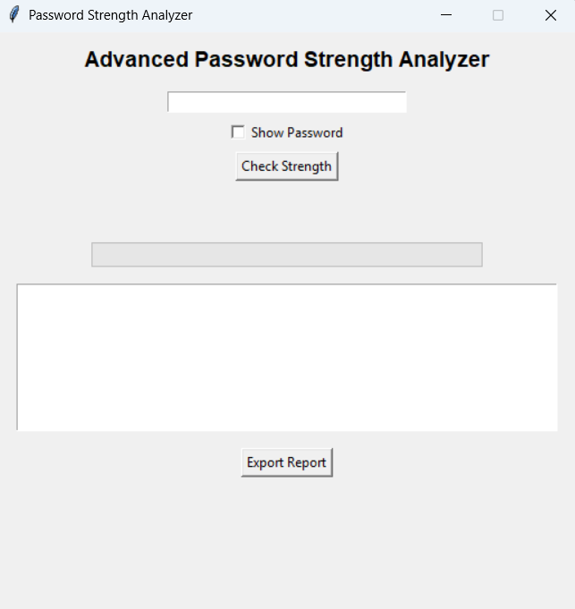
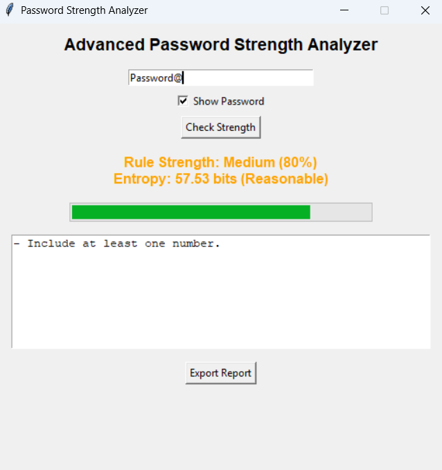
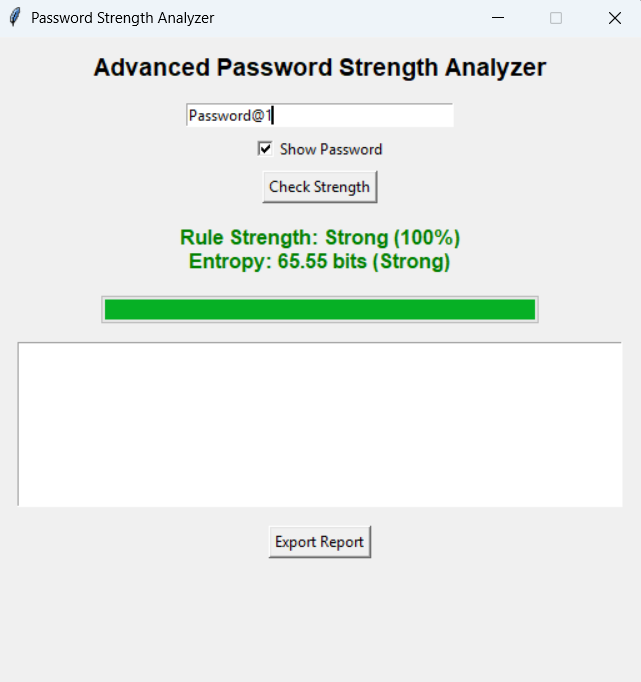

# 🔐 Advanced Password Strength Analyzer

A modular Python-based password strength analyzer with:

- Regex-based validation
- Entropy calculation
- Entropy classification tiers
- Common password detection
- Strength progress bar
- Show/Hide password toggle
- Export report functionality
- Unit testing support

## 🛠 Technologies Used
- Python 3
- re (Regular Expressions)
- Tkinter (GUI)
- math (Entropy calculation)
- unittest (Testing)

## 🚀 Features
- Rule-based strength evaluation
- Percentage scoring
- Entropy measurement (bits)
- Entropy classification (Very Weak → Very Strong)
- Detection of commonly used passwords
- GUI-based interface
- Export analysis report

## ▶ How to Run

```bash
python main.py


## 📸 Application Screenshots

### 🖥 Main Interface


### 🔴 Weak Password


### 🟠 Medium Password


### 🟢 Strong Password

